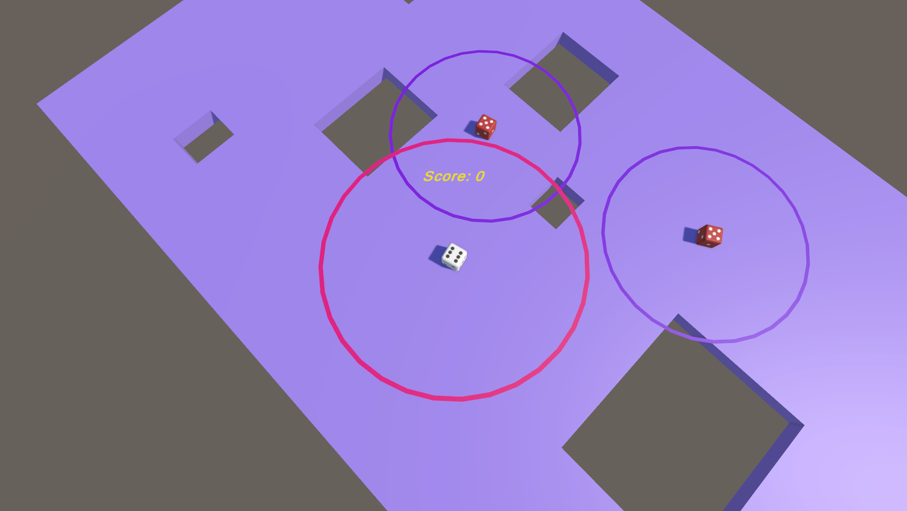
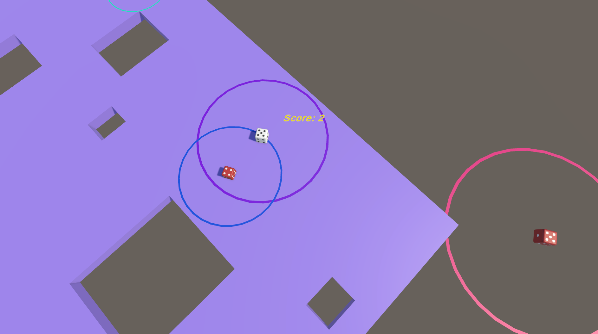

# 

## Description

You are on a platform which is surrounded by void. The objective is to make the biggest score.

You can earn points by knocking enemies off the plateform with your dash. The dash's power depends on the number on the top of the dice. The higher the number, the more powerful it is.

## Description

You can download the game [here](https://krinest.itch.io/falling-dice#download).

## ScreenShots

|  |
| -------------------------------------- |
|  |

## License

Distributed under the MIT License. See [`LICENSE`](https://github.com/Falling-Dice/Game/blob/master/LICENSE) for more information.

[@KristenJestin](https://www.github.com/KristenJestin)

 

[@Naedim](https://www.github.com/Naedim)

